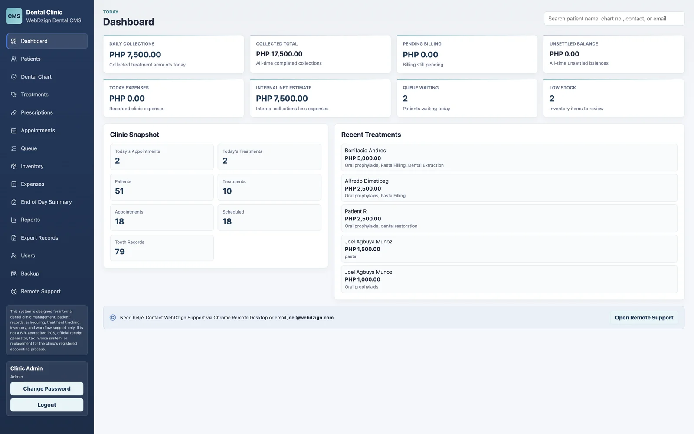
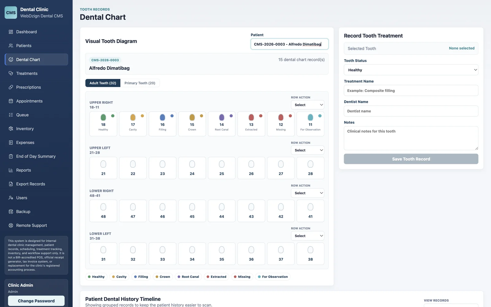
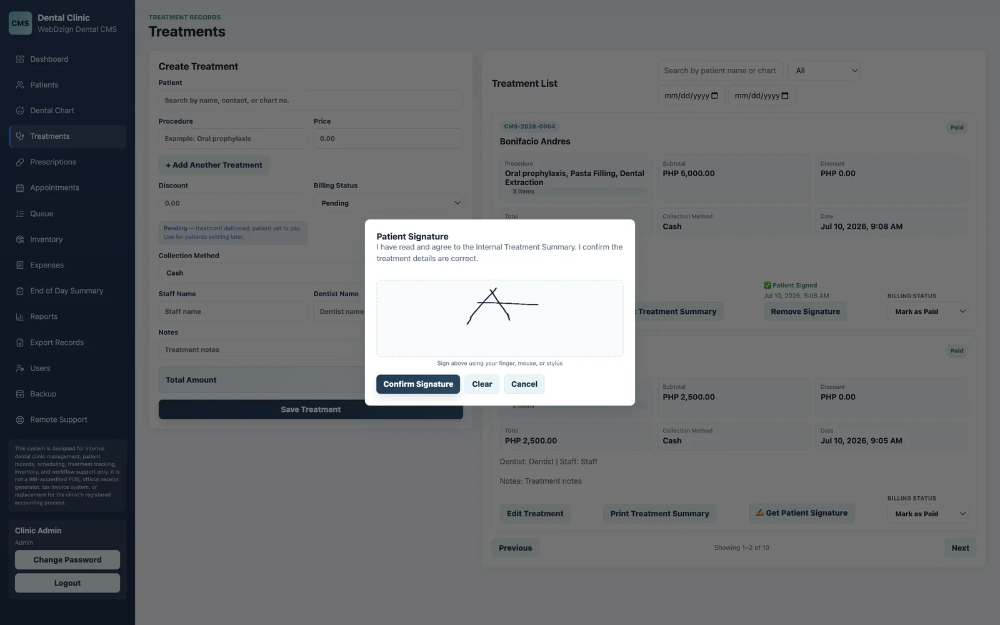

# WebDzign Dental CMS

**Flagship commercial product — live in Philippine dental clinics today.**

A complete offline clinic management system. Everything a clinic needs runs on one computer: no internet required, no monthly subscription.

**Stack:** Electron · React · SQLite

## What it does

- Patient records, appointments, and billing in one system
- Visual tooth chart — per-tooth status for adult and primary dentition (healthy, cavity, filling, crown, root canal, extracted, missing, for observation)
- Billing with zero float-drift arithmetic for accurate money handling
- Prescriptions, inventory with low-stock alerts, daily queue, expenses, end-of-day summary
- Treatment records with patient signature capture
- Remote support tab and branded Windows installer
- Hardware-locked commercial licensing
- Built-in backup and export

## Screenshots (demo data)

**Dashboard — daily collections, queue, recent treatments**

**Visual dental chart**

**Treatment record with signature capture**

---

*Source code is private (commercial product). For pricing or a live walkthrough: [webdzign.com/contact](https://www.webdzign.com/contact)*
