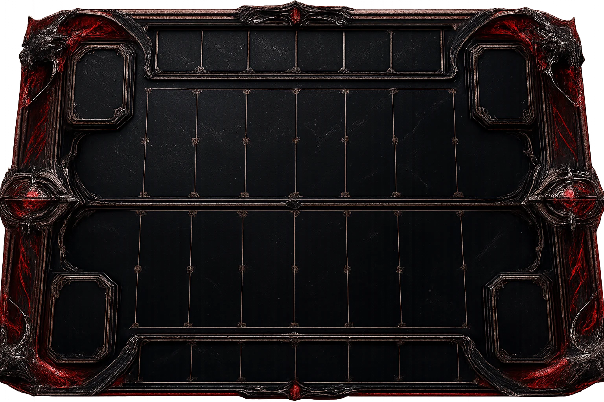
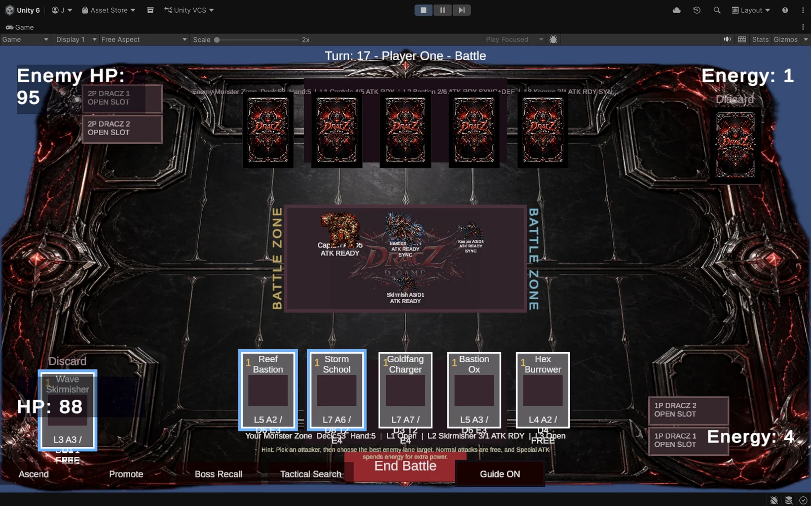

# DracZ D. GamE

**Original Unity card-battle prototype — final prototype milestone.**

A dark fantasy-tech card game where cards summon units into lane combat, clans define strategy, and DracZ support slots create comeback moments.

**Stack:** Unity · C#

## What it proves

- Lane-based unit combat with readable battle feedback
- ATK/DEF stat systems and clan strategy
- Tutorial guidance with guide highlights
- Full visual identity: board, card backs, boss sprites, key art

## Visuals

**The battle board**

**Final prototype battle screen**

---

*Full devlog with the complete story: [webdzign.com/devlog](https://www.webdzign.com/devlog)*
