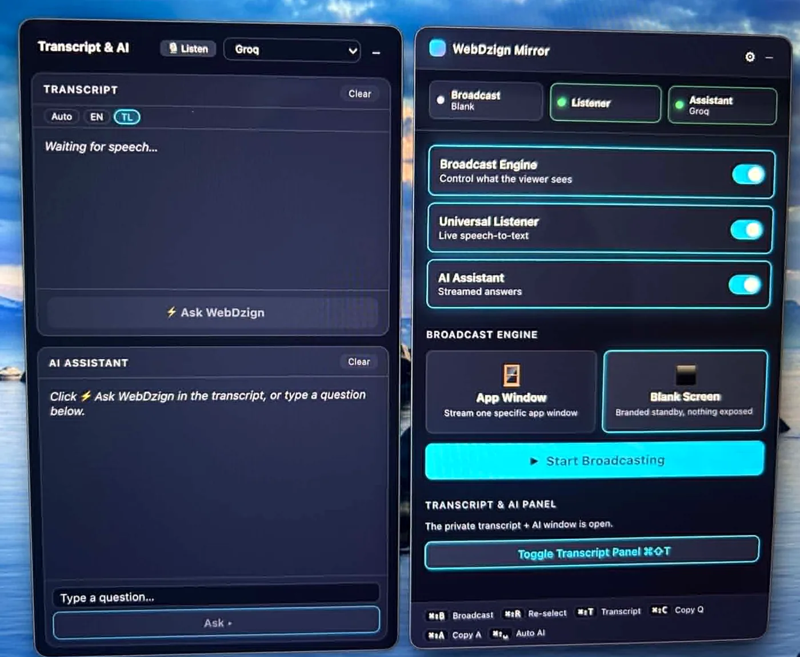

# WebDzign Mirror

**Internal tool — macOS, functional and tested on real calls.**

Real-time call transcription in a macOS menu bar app, with an AI Q&A layer that works on top of the live transcript.

**Stack:** Electron · React · Vite · BlackHole audio routing

## What it does

- Real-time call transcription in a menu bar app
- Auto / English / Filipino language detection
- AI-powered Q&A on top of the live transcript
- BlackHole audio routing for capturing call audio
- Hides itself from all screen recording for call privacy — which is why the photo below had to be taken with an actual camera

## The one photo that exists

*The app is invisible to screen capture by design. This is a photograph of the screen.*

---

*Internal tool — not for sale, but it shows what I build. Inquiries: [webdzign.com/contact](https://www.webdzign.com/contact)*
